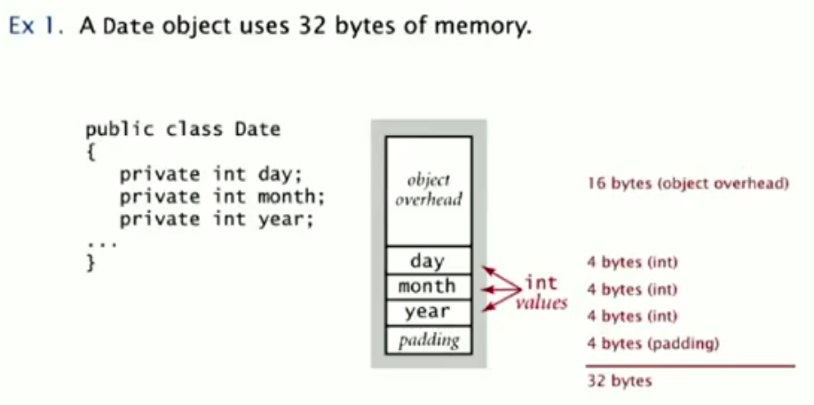
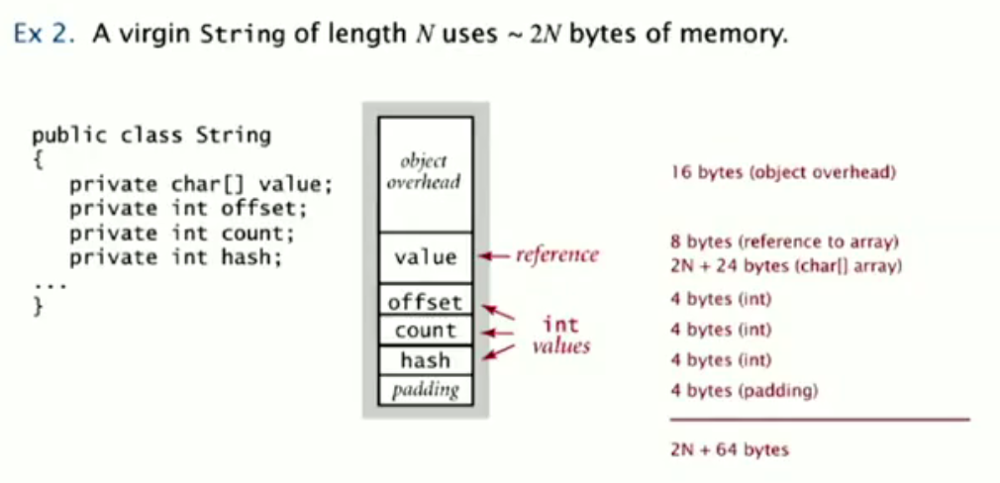
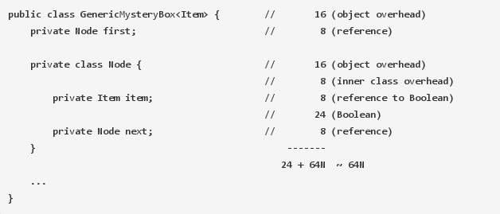

Memory Model
============

Basic
-----

*Bits*
    0 or 1.

*Byte*
    8 bits.

*Megabyte(MB)*
    1 million or 2^20 bytes.

*Gigabyte(GB)*
    1 billion or 2^30 bytes.

*Pointer*
    4 bytes(32-bit machine) or 8 bytes(64-bit machine)

Primitive types and arrays
--------------------------

+--------------+---------+
| type         | bytes   |
+==============+=========+
| boolean      | 1       |
+--------------+---------+
| byte         | 1       |
+--------------+---------+
| char         | 2       |
+--------------+---------+
| int          | 4       |
+--------------+---------+
| float        | 4       |
+--------------+---------+
| long         | 8       |
+--------------+---------+
| double       | 8       |
+--------------+---------+
| char[]       | 2N+24   |
+--------------+---------+
| int[]        | 4N+24   |
+--------------+---------+
| double[]     | 8N+24   |
+--------------+---------+
| char[][]     | ~ 2MN   |
+--------------+---------+
| int[][]      | ~ 4MN   |
+--------------+---------+
| double[][]   | ~ 8MN   |
+--------------+---------+

Objets
------

*Object overhead*
    16 bytes.

*Reference*
    8 bytes.

*Padding*
    Each object uses a multiple of 8 bytes.

Examples:

